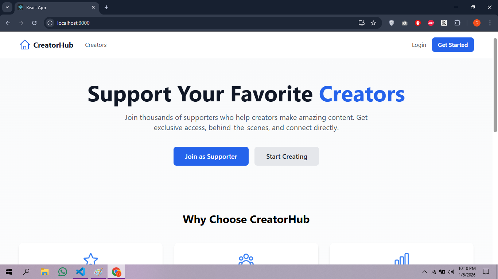
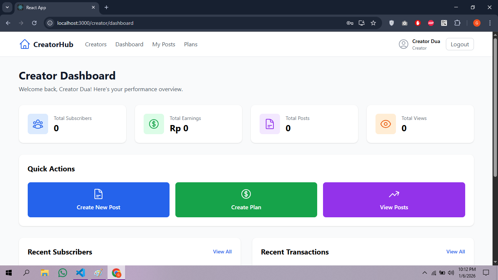
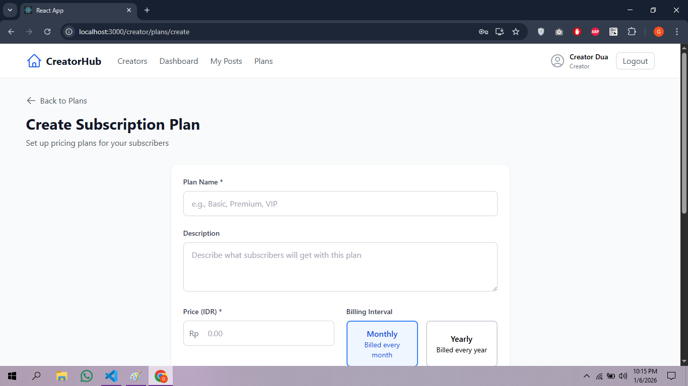
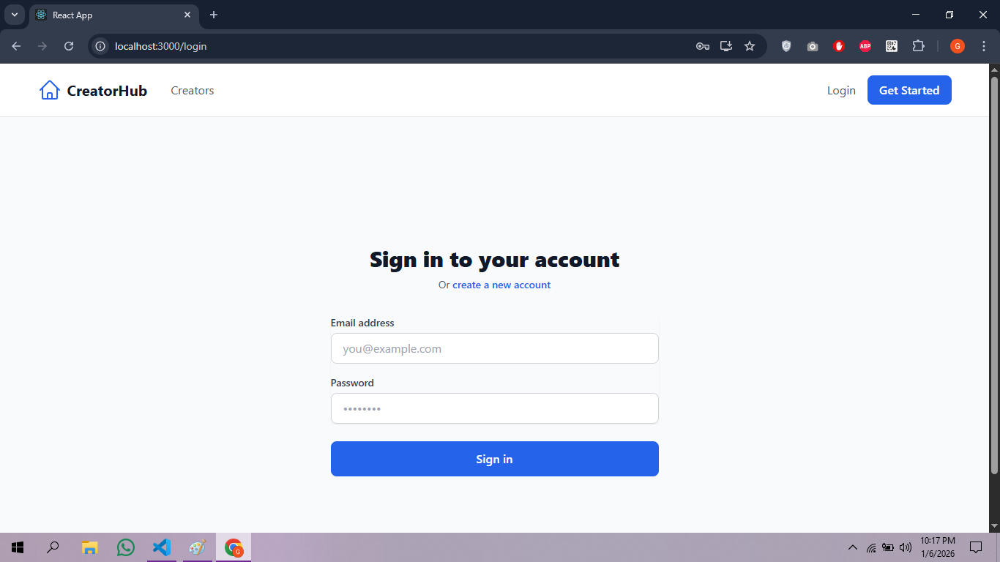
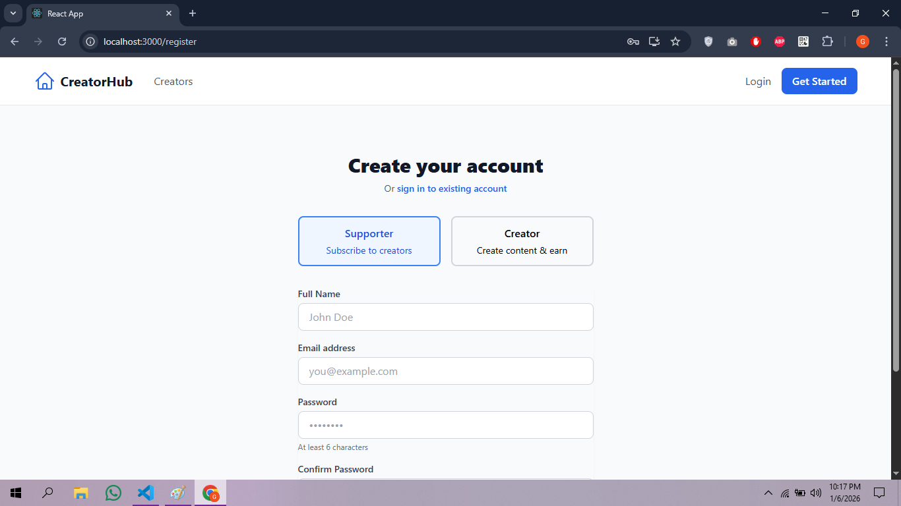

# 🎨 Creator Subscription Platform

A mini Patreon-like platform where creators can monetize their content through subscriptions.

## 🚀 Features

### ✅ Implemented
- **Authentication System**: Register/Login with JWT & role-based access (user/creator/admin)
- **Creator Dashboard**: Stats overview, post management, subscription plans
- **Content Management**: Create posts with visibility control (public/subscribers_only)
- **Subscription System**: Create plans, subscribe, cancel subscriptions
- **Payment Integration**: Midtrans payment gateway with webhook handling

### 🚧 In Progress
- Post access control (locked/unlocked content)
- Browse creators page
- Admin panel
- Complete payment flow

## 🛠️ Tech Stack

### Backend
- **Runtime**: Node.js + Express
- **Database**: PostgreSQL + Sequelize ORM
- **Authentication**: JWT + bcrypt
- **Payment**: Midtrans
- **Email**: Nodemailer (for notifications)

### Frontend
- **Framework**: React.js
- **Styling**: Tailwind CSS
- **Routing**: React Router DOM
- **HTTP Client**: Axios
- **State Management**: React Context API

## 🚀 Getting Started

### Prerequisites
- Node.js (v14 or higher)
- PostgreSQL (v12 or higher)
- npm or yarn

### Installation

1. **Clone the repository**
```bash
git clone https://github.com/chelbapolandaa/Mini-Patreon.git
cd Mini-Patreon
```

2. **Setup Backend**
```bash
cd backend
npm install
cp .env.example .env
# Edit .env with your database credentials and Midtrans keys
```

3. **Setup Database**
```bash
# Create database
psql -U postgres -c "CREATE DATABASE creator_platform;"

# Run the server to auto-create tables
npm run dev
```

4. **Setup Frontend**
```bash
cd ../frontend
npm install
npm start
```

5. **Access the application**
Frontend: http://localhost:3000

Backend API: http://localhost:5000

## 📊 Database Schema
```bash
users
├── id (UUID)
├── email (VARCHAR)
├── password_hash (VARCHAR)
├── name (VARCHAR)
├── role (ENUM: user/creator/admin)
├── is_verified (BOOLEAN)
└── created_at (TIMESTAMP)

posts
├── id (UUID)
├── creator_id (UUID → users)
├── title (VARCHAR)
├── content (TEXT)
├── visibility (ENUM: public/subscribers_only)
└── created_at (TIMESTAMP)

subscription_plans
├── id (UUID)
├── creator_id (UUID → users)
├── name (VARCHAR)
├── price (DECIMAL)
└── interval (ENUM: monthly/yearly)

subscriptions
├── id (UUID)
├── user_id (UUID → users)
├── creator_id (UUID → users)
├── plan_id (UUID → subscription_plans)
├── status (ENUM: active/cancelled/expired)
└── end_date (TIMESTAMP)

transactions
├── id (UUID)
├── user_id (UUID → users)
├── creator_id (UUID → users)
├── amount (DECIMAL)
├── status (ENUM: pending/success/failed)
└── midtrans_order_id (VARCHAR)
```

## 🔧 Environment Variables

### Backend (.env)
```bash
PORT=5000
DB_HOST=localhost
DB_PORT=5432
DB_NAME=mini_patreon
DB_USER=postgres
DB_PASSWORD=your_password

JWT_SECRET=your_jwt_secret_key
JWT_EXPIRE=7d

MIDTRANS_SERVER_KEY=your_midtrans_server_key
MIDTRANS_CLIENT_KEY=your_midtrans_client_key
MIDTRANS_IS_PRODUCTION=false

SMTP_HOST=smtp.gmail.com
SMTP_PORT=587
SMTP_USER=your_email@gmail.com
SMTP_PASS=your_app_password
```

### Frontend (.env)
```bash
REACT_APP_API_URL=http://localhost:5000/api
```

## 🔧 Roadmap

## 📝 API Endpoints

### Authentication
POST /api/auth/register - Register new user

POST /api/auth/login - Login user

GET /api/auth/me - Get current user

### Creator
GET /api/creators/dashboard/stats - Get creator stats

POST /api/creators/posts - Create post

GET /api/creators/posts - Get creator's posts

POST /api/creators/plans - Create subscription plan

### Subscription
GET /api/subscriptions/plans/:creatorId - Get creator's plans

POST /api/subscriptions/subscribe - Subscribe to creator

GET /api/subscriptions/my - Get user's subscriptions

### Webhook
POST /api/payments/midtrans/webhook - Midtrans payment notification

## 🎥 Demo
<p align="center">
<video src="./demo/Demo.mp4" controls width="800"></video>
</p>

**Demo Flow:**
- Creator login & dashboard
- Create subscription plan
- User checkout via Midtrans (Sandbox)
- Successful payment & content unlock

## 📸 Screenshots
<div align="center">

### Home


### Dashboard


### Dashboard Posts


### Create Post


### Dashboard Plan


### Create Post


### Login


### Register


</div>

## 📄 License

This project is licensed under the MIT License - see the [LICENSE](LICENSE) file for details.

## 🙏 Acknowledgments

Midtrans for payment gateway

Sequelize for ORM

Tailwind CSS for styling

<div align="center">
Built with ❤️
</div>
